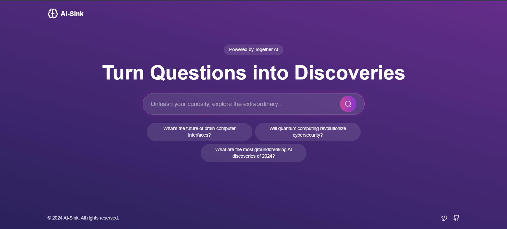
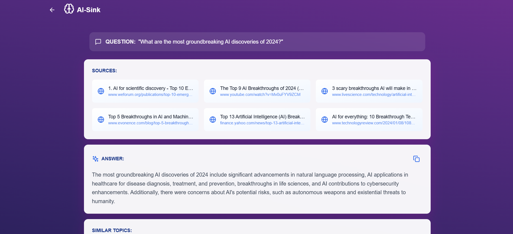

<p align="center">
  <b>AI-SINK: An Open-Source AI-Powered Search Engine</b><br>
  Harnessing the power of advanced language models and modern search APIs.
</p>

[](https://www.together.ai)
[](https://reactjs.org)
[](https://opensource.org/licenses/MIT)

> Transform your questions into discoveries with AI-powered search and insights.

## ✨ Features

- 🔮 **Smart Search**: Harness the power of AI to find precise answers to your questions
- 🎯 **Accurate Sources**: Get information from reliable and verified sources
- 🌈 **Beautiful UI**: Enjoy a stunning, responsive interface with smooth animations
- 🚀 **Lightning Fast**: Get instant answers powered by Together AI
- 🔄 **Similar Topics**: Discover related questions and expand your knowledge
- 📱 **Mobile Ready**: Perfect experience across all devices
- 🎨 **Image Generation**: Create stunning AI-generated images from text descriptions
- 🎤 **Voice Search**: Search hands-free with voice commands for enhanced accessibility

## 🎯 Live Demo

Experience AI-Sink in action: [Live Demo](https://ai-sink.vercel.app/)

## 🛠️ Tech Stack

- **Frontend**: React + TypeScript
- **Styling**: Tailwind CSS
- **AI**: Together AI
- **Search**: Serper API
- **Analytics**: Helicone
- **Deployment**: Netlify

## 🚀 Getting Started

1. Clone the repository:
```bash
git clone https://github.com/Saoud30/AI-Sink.git
```

2. Install dependencies:
```bash
cd ai-sink
npm install
```
3. **Configure Environment:** 
   - Use the `.example.env` file as a reference to create a `.env` file. Add the necessary API keys.

4. Create a `.env` file with your API keys:
```env
VITE_TOGETHER_API_KEY=your_together_api_key
VITE_SERPER_API_KEY=your_serper_api_key
VITE_HELICONE_API_KEY=your_helicone_api_key
```

5. Start the development server:
```bash
npm run dev
```

## 📸 Screenshots

<div align="center">
  
</div>

<div align="center">
  
</div>
## 🤝 Contributing

Contributions are welcome! Please feel free to submit a Pull Request. For major changes, please open an issue first to discuss what you would like to change.

## 📄 License

This project is licensed under the MIT License - see the [LICENSE](LICENSE) file for details.

## 🌟 Support

If you found this project helpful, please consider giving it a star ⭐️

## 🔮 Future Plans

- Voice Search Integration
- Multi-language Support
- Custom Themes
- Advanced Search Filters
- PDF/Document Analysis
- Chrome Extension

---

<p align="center">Made with ❤️ by <a href="https://github.com/Saoud30">Mohd Saoud</a></p>

<p align="center">
  <a href="https://twitter.com/Shazyansar">Twitter</a> •
  <a href="www.linkedin.com/in/mohd-saoud30">LinkedIn</a> •
</p>